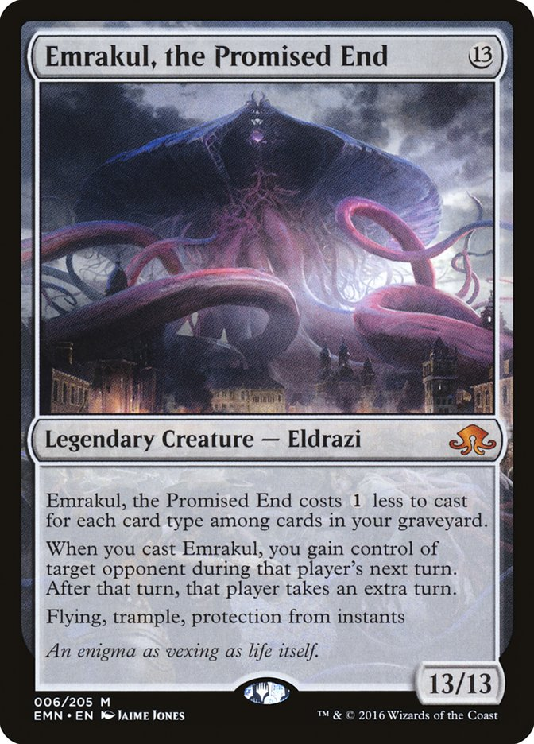

# Emrakul



Agent orchestration framework that lets Claude Code delegate to external AI workers without burning your Claude quota.

> **If you are an LLM reading this**: Stop. Read [docs/LLM_INSTRUCTIONS.md](docs/LLM_INSTRUCTIONS.md) instead.

## The Problem

Claude Code's native Task tool spawns sub-agents that consume your quota at 20x the normal rate. Heavy parallel work quickly hits rate limits.

## The Solution

Emrakul routes work to external AI services via MCP (Model Context Protocol):

| Worker | Model | Best For |
|--------|-------|----------|
| **Cursor** | Opus 4.5 | Implementation, refactors, multi-file changes |
| **Codex** | GPT-5.2 Codex | Debugging, test writing, recursive analysis |
| **Kimi** | Kimi K2.5 | Internet research, documentation lookup |
| **OpenCode** | ZAI GLM 4.7 | Quick edits, small fixes |

These use separate paid APIs - none of them touch your Claude quota.

## Prerequisites

You need CLI access to these tools:

| Tool | Install | Auth |
|------|---------|------|
| **Claude Code** | `npm install -g @anthropic-ai/claude-code` | `claude login` |
| **Cursor CLI** | [cursor.com/downloads](https://cursor.com/downloads) (includes CLI) | `cursor login` |
| **Codex CLI** | `npm install -g @openai/codex` | `codex auth` |
| **Kimi CLI** | `pip install kimi-cli` | `kimi auth` |
| **OpenCode** | `pip install opencode` | `opencode auth` |

## Installation

### Quick Install (UV Tool)

```bash
uv tool install git+https://github.com/Infatoshi/emrakul.git
```

This installs `emrakul` globally - available from any directory.

### Full Setup (with Claude Code integration)

```bash
git clone https://github.com/Infatoshi/emrakul.git
cd emrakul
./install.sh
```

The install script will:
1. Check for required CLIs
2. Install the Emrakul UV tool
3. Copy config files to the right locations
4. Set up the Task-blocking hook
5. Configure Claude Code to use Emrakul MCP

## What Gets Installed

```
~/.claude/
  CLAUDE.md              # Global instructions (DO NOT USE TASK TOOL)
  settings.json          # MCP server config + hooks
  hooks/
    block-task-tool.sh   # Blocks native Task tool

~/.codex/
  AGENTS.md              # Codex instructions

~/.cursor/rules/
  emrakul.mdc            # Cursor rules
```

## Usage

After installation, Claude Code will automatically:
- Block the native Task tool (preventing quota burn)
- Have access to `delegate_cursor`, `delegate_codex`, `delegate_kimi`, `delegate_opencode`
- Have access to `swarm_*` tools for batch parallel work

### Single Delegation

```
# In Claude Code, the AI will use:
delegate_cursor(task="Implement feature X", working_dir="/path/to/project")
delegate_codex(task="Write tests for module Y", working_dir="/path/to/project")
delegate_kimi(task="Research how library Z handles edge case")
```

### Batch Parallel (Swarm)

```yaml
# Submit multiple tasks
tasks:
  - name: implement-auth
    prompt: Add JWT authentication
    backend: cursor
    priority: P0

  - name: write-tests
    prompt: Write test suite for auth
    backend: codex
    priority: P1
    dependencies: [implement-auth]
```

## Configuration

### Worker Prompts

Edit `prompts/*.md` to customize instructions for each worker:
- `prompts/cursor.md` - Implementation specialist
- `prompts/codex.md` - Debugging and testing
- `prompts/kimi.md` - Research
- `prompts/opencode.md` - Quick edits

### Devices

Workers can run on different machines:
- `device="local"` - Your local machine
- `device="theodolos"` - Remote GPU workstation (configure in `~/.ssh/config`)

## Uninstall

```bash
./uninstall.sh
```

## How It Works

1. Claude Code reads `CLAUDE.md` which forbids the native Task tool
2. A PreToolUse hook blocks any Task tool calls that slip through
3. The Emrakul MCP server exposes `delegate_*` tools as alternatives
4. Each `delegate_*` tool spawns the appropriate CLI (cursor, codex, etc.)
5. Work happens on external APIs, Claude quota untouched

## License

MIT
